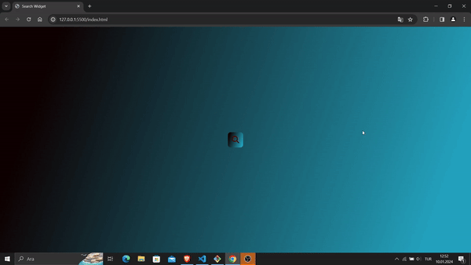

# Arama Widget Projesi

Bu depo, HTML, CSS ve JavaScript kullanılarak oluşturulmuş basit bir arama widget'ı için kaynak kodlarını içermektedir. Arama widget'ı, arama yapmak için bir giriş alanı ve görsel çekiciliği artırmak için bir büyüteç simgesi içeren bir düğme içerir.

## Özellikler:
- **HTML Yapısı:** Meta etiketleri, başlık ve harici CSS ve JavaScript dosyalarıyla standart HTML5 yapısını kullanır.
- **Stil:** Stiller, görünümü geliştirmek için ayrı bir CSS dosyasında (`style.css`) tanımlanmıştır.
- **Font Awesome Entegrasyonu:** Görsel arayüzü güçlendirmek için Font Awesome simgelerini kullanır.
- **Duyarlı Tasarım:** Düzen, çeşitli cihazlarda sorunsuz bir deneyim sağlamak üzere tasarlanmıştır.

## Dosyalar ve Dizinler:
- **index.html:** Arama widget'ının yapısını içeren ana HTML dosyası.
- **style.css:** Arama widget'ını stilize etmek için kullanılan Cascading Style Sheets dosyası.
- **main.js:** Ek etkileşim veya işlevsellik için JavaScript dosyası.

## Kullanım:
1. Projeyi yerel makinenize klonlayın.
   ```bash
 

2. `index.html` dosyasını bir web tarayıcısında açarak arama widget'ını görüntüleyin ve etkileşimde bulunun.


## Ekran Görüntüsü:

